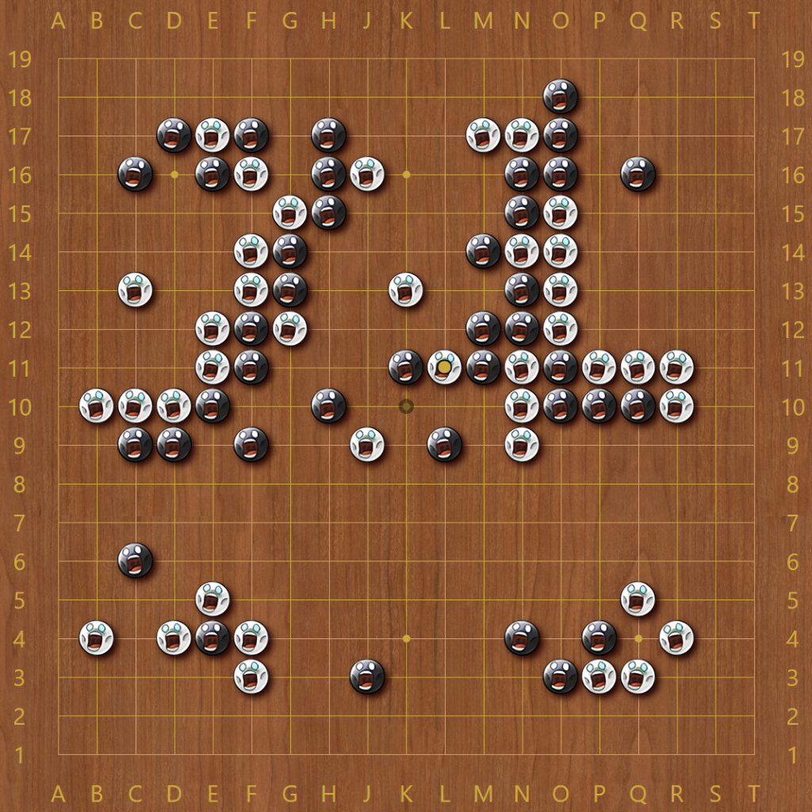

# BattsGo Theme for Sabaki

A theme for [Sabaki](http://sabaki.yichuanshen.de/) based on the [BattsGo](https://www.twitch.tv/battsgo/) twitch stream.



The theme features the `battsgBfine` and `battsgWfine` twitch emotes for the Black and White stones. Markers have been redesigned to fit in with the busy visuals of the stones. The twitch emotes `battsgBzstone` and `battsgWzstone` are used to show stones that are marked as dead during scoring/estimation.


 

## Installation

Download the theme file `battsgo.asar` (or pack it yourself) and install it directly inside Sabaki under 'Preferences' > 'Themes' > 'Install Theme...'.

Packing
Make sure you have [node.js and npm](https://nodejs.org/)  installed. If you don't have `asar` installed already, run:

```
$ npm install asar -g
```

To pack your userstyle into a theme, run the following command:

```
$ asar pack ./theme ./battsgo.asar
```

`battsgo.asar` will be created and is ready for distribution. It can be installed in Preferences.